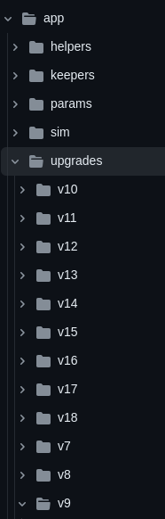

# Upgrade paxd

A guide on how to updgrade the pax network.

## Cosmovisor

Cosmovisor is the recomended way to upgrade your validator node.
More info on [Cosmosvisor](https://docs.cosmos.network/main/build/tooling/cosmovisor)

### Start Cosmovisor

Cosmosvisor is a wrapper around paxd that listens to upgrade planes being passed on the network. A upgrade plan contains a upgradeheigth and binary path. 

Cosmosvisor will use the binary path to download the new binary if autoupdate has been passed in the starting arguments. This is not the recomendede way of doing it.

Recomended way of doing the upgrade is to download the new binary manuley and place it in the correct place in the cosmovisor folder structure 

Cosmovisor sets up the folder strukture by its self. 
```
.
├── current -> genesis or upgrades/<name>
├── genesis
│   └── bin
│       └── $DAEMON_NAME
└── upgrades
│   └── <name>
│       ├── bin
│       │   └── $DAEMON_NAME
│       └── upgrade-info.json
└── preupgrade.sh (optional)
```

### Cosmovisor init
Post v1 versions of Cosmovisor have a command that will create the directories and copy the `paxd` binary into the proper directory. To create the directories and copy the binary, run this command:

```
cosmovisor init $HOME/go/bin/paxd
```
Once you're done, check the folder structure looks correct using a tool like `tree`.

### Cosmovisor config

In the .profile file, usually located at ~/.profile, add:

```
export DAEMON_NAME=paxd
export DAEMON_HOME=$HOME/.pax
```
Then source your profile to have access to these variables:

```
source ~/.profile
```
You can confirm success like so:

```
echo $DAEMON_NAME
```
It should return paxd.

`cosmovisor` reads its configuration from environment variables:

- `DAEMON_HOME` is the location where the `cosmovisor/` directory is kept that contains the genesis binary, the upgrade binaries, and any additional auxiliary files associated with each binary (e.g. `$HOME/.pax`, `$HOME/.unigrid`, etc.).
- `DAEMON_NAME` is the name of the binary itself (e.g. `paxd`, etc.).
- `DAEMON_ALLOW_DOWNLOAD_BINARIES` (_optional_), if set to `true`, will enable auto-downloading of new binaries (for security reasons, this is intended for full nodes rather than validators). By default, `cosmovisor` will not auto-download new binaries.
- `DAEMON_DOWNLOAD_MUST_HAVE_CHECKSUM` (_optional_, default = `false`), if `true` cosmovisor will require that a checksum is provided in the upgrade plan for the binary to be downloaded. If `false`, cosmovisor will not require a checksum to be provided, but still check the checksum if one is provided.
- `DAEMON_RESTART_AFTER_UPGRADE` (_optional_, default = `true`), if `true`, restarts the subprocess with the same command-line arguments and flags (but with the new binary) after a successful upgrade. Otherwise (`false`), `cosmovisor` stops running after an upgrade and requires the system administrator to manually restart it. Note restart is only after the upgrade and does not auto-restart the subprocess after an error occurs.
- `DAEMON_RESTART_DELAY` (_optional_, default none), allow a node operator to define a delay between the node halt (for upgrade) and backup by the specified time. The value must be a duration (e.g. `1s`).
- `DAEMON_SHUTDOWN_GRACE` (_optional_, default none), if set, send interrupt to binary and wait the specified time to allow for cleanup/cache flush to disk before sending the kill signal. The value must be a duration (e.g. `1s`).
- `DAEMON_POLL_INTERVAL` (_optional_, default 300 milliseconds), is the interval length for polling the upgrade plan file. The value must be a duration (e.g. `1s`).
- `DAEMON_DATA_BACKUP_DIR` option to set a custom backup directory. If not set, `DAEMON_HOME` is used.
- `UNSAFE_SKIP_BACKUP` (defaults to `false`), if set to `true`, upgrades directly without performing a backup. Otherwise (`false`, default) backs up the data before trying the upgrade. The default value of false is useful and recommended in case of failures and when a backup needed to rollback. We recommend using the default backup option `UNSAFE_SKIP_BACKUP=false`.
- `DAEMON_PREUPGRADE_MAX_RETRIES` (defaults to `0`). The maximum number of times to call [pre-upgrade](https://docs.cosmos.network/main/build/building-apps/app-upgrade#pre-upgrade-handling) in the application after exit status of `31`. After the maximum number of retries, Cosmovisor fails the upgrade.
- `COSMOVISOR_DISABLE_LOGS` (defaults to `false`). If set to true, this will disable Cosmovisor logs (but not the underlying process) completely. This may be useful, for example, when a Cosmovisor subcommand you are executing returns a valid JSON you are then parsing, as logs added by Cosmovisor make this output not a valid JSON.
- `COSMOVISOR_COLOR_LOGS` (defaults to `true`). If set to true, this will colorise Cosmovisor logs (but not the underlying process).
- `COSMOVISOR_TIMEFORMAT_LOGS` (defaults to `kitchen`). If set to a value (`layout|ansic|unixdate|rubydate|rfc822|rfc822z|rfc850|rfc1123|rfc1123z|rfc3339|rfc3339nano|kitchen`), this will add timestamp prefix to Cosmovisor logs (but not the underlying process).
- `COSMOVISOR_CUSTOM_PREUPGRADE` (defaults to ``). If set, this will run $DAEMON_HOME/cosmovisor/$COSMOVISOR_CUSTOM_PREUPGRADE prior to upgrade with the arguments [ upgrade.Name, upgrade.Height ]. Executes a custom script (separate and prior to the chain daemon pre-upgrade command)
- `COSMOVISOR_DISABLE_RECASE` (defaults to `false`). If set to true, the upgrade directory will expected to match the upgrade plan name without any case changes

## Set up service
Commands sent to Cosmovisor are sent to the underlying binary. For example, `cosmovisor` version is the same as typing `paxd version`.

Nevertheless, just as we would manage `paxd` using a process manager, we would like to make sure Cosmovisor is automatically restarted if something happens, for example an error or reboot.

First, create the service file:

```
sudo nano /etc/systemd/system/paxd.service
````
Change the contents of the below to match your setup - `cosmovisor` is likely at `~/go/bin/cosmovisor` regardless of which installation path you took above, but it's worth checking.

Note `cosmovisor run start` is only for the latest versions of cosmovisor. For earlier versions that line should be:

```
ExecStart=/home/<your-user>/go/bin/cosmovisor start
````
```
[Unit]
Description=Pax Daemon (cosmovisor)
After=network-online.target

[Service]
User=<your-user>
ExecStart=/home/<your-user>/go/bin/cosmovisor run start
Restart=always
RestartSec=3
Environment="DAEMON_NAME=paxd"
Environment="DAEMON_HOME=/home/<your-user>/.pax"
Environment="DAEMON_ALLOW_DOWNLOAD_BINARIES=false"
Environment="DAEMON_RESTART_AFTER_UPGRADE=true"
Environment="DAEMON_LOG_BUFFER_SIZE=512"

[Install]
WantedBy=multi-user.target
```
> A description of what the environment variables do can be found here. Change them depending on your setup.


In addition, the same issue can be fixed by reducing the log via env variable. If you are unsure, ask on Discord.

## Modules

When doing an upgrade to a module do the following

### Create a new UpgradeHandler

When upgrading paxd you need to add a UpgradeHandler that handels state changes and initates new params. 

Make a new folder under upgrades named the new version number. 



### Propose an upgrade

A upgrade is proposed and voted on. If the vote is passed it will trigger 
