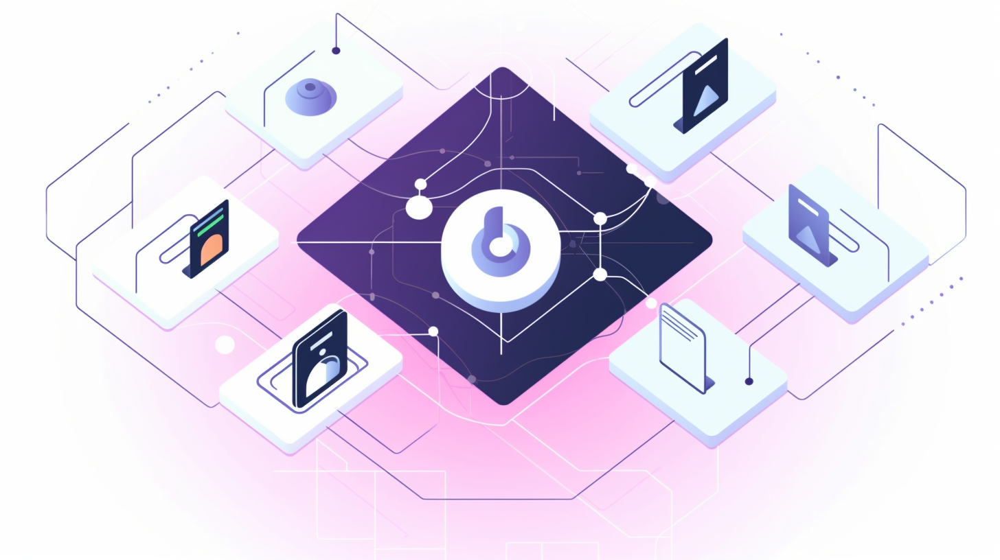

# Unigrid DAO Proposal

## Introduction

The Unigrid Decentralized Autonomous Organization (DAO) represents a pivotal step in the evolution of the Unigrid project. This proposal outlines the establishment of the DAO, its governance structure, and its primary objectives. By voting "yes" on this proposal, the community acknowledges the importance of a decentralized governance model and empowers the DAO with specific authorities, most notably the authority to conduct a token sale on the launchpad NFPad.

## Why the DAO?

The DAO is designed to:

1. **Decentralize Decision Making:** Ensure that decisions about the project's future are made collectively, reflecting the diverse perspectives of the community.
2. **Enhance Transparency:** Establish clear rules and procedures, ensuring that all actions and decisions are transparent and accountable.
3. **Facilitate Growth:** By empowering the DAO to raise funds, we can accelerate the development and expansion of the Unigrid ecosystem.

## Token Sale on NFPad

One of the primary authorities granted to the DAO is the ability to conduct a token sale on the launchpad NFPad. This sale is crucial for several reasons:

- **Raising Capital for Development:** The proceeds from this sale will be allocated to UGD Software AB, which will use these funds primarily for software development. This ensures that the Unigrid project continues to innovate and remains at the forefront of decentralized internet solutions.
- **Expanding the Ecosystem:** The funds will also be used to expand the suite of decentralized applications within the Unigrid ecosystem, further enhancing its utility and value proposition.

## Importance of the DAO for the Unigrid Project

The establishment of the DAO is not just a governance decision; it's a statement about the future direction of the Unigrid project:

- **Community Empowerment:** The DAO ensures that the community remains at the heart of the project, with a significant say in its direction and growth.
- **Flexibility & Adaptability:** The DAO's governance structure allows for adaptability, ensuring that the project can quickly respond to changing circumstances or new opportunities.
- **Long-Term Vision:** With a clear governance model and the ability to raise funds for development, the DAO ensures that the Unigrid project is set up for long-term success.

## Accessing the DAO

The DAO is available as a PDF for those who wish to view it in a traditional format or desire an offline copy. You can directly access and download the PDF version from our GitHub repository.

[Download the Unigrid DAO PDF from GitHub](<github_link_to_the_PDF>)

## DAO Document History and Integrity

Transparency and trust are foundational to our project. To ensure that every change made to the DAO is transparent and verifiable:

- **Commit Hashes:** Every revision of the DAO is committed to our GitHub repository. Each commit has a unique hash, ensuring the integrity and immutability of the document's history.
- **Transparent Tracking:** Community members can easily track changes, view previous versions, and verify the authenticity of the DAO by checking the commit hashes on GitHub.
- **Accessible History:** For those interested in a detailed exploration, you can view the entire commit history, along with their respective hashes, at our [GitHub repository](https://github.com/unigrid-project/unigrid-project.github.io).

By leveraging the power of GitHub's version control, we ensure that the DAO remains a living document, evolving with the needs of the community while maintaining a clear and verifiable history.

## Conclusion

The Unigrid DAO proposal is a comprehensive blueprint for the project's future governance and growth. By voting "yes" on this proposal, the community is not just endorsing a set of rules; they are expressing confidence in a decentralized, transparent, and community-driven future for Unigrid. We urge all members of the community to carefully review this proposal, understand its implications, and participate in the voting process.

{: .fs-6 .fw-300 }

