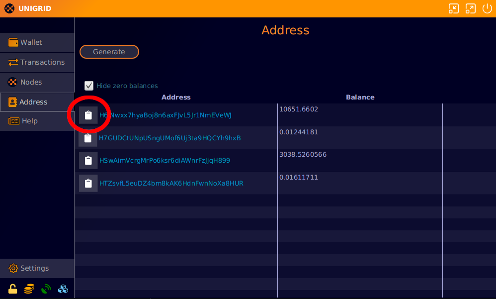
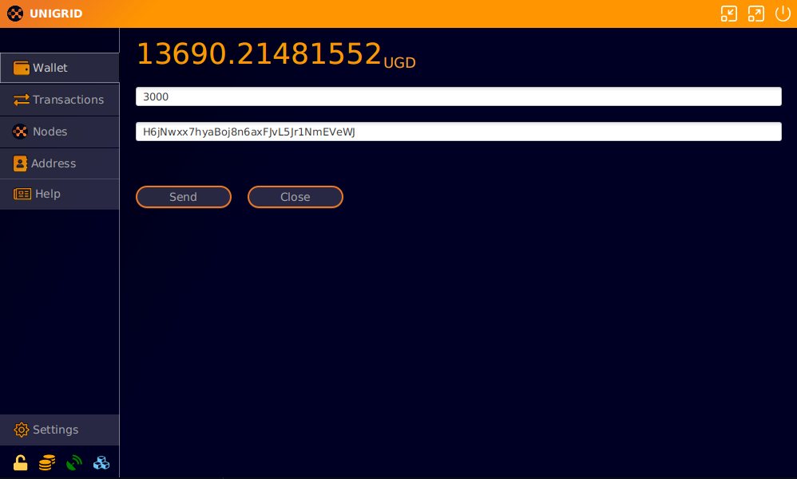
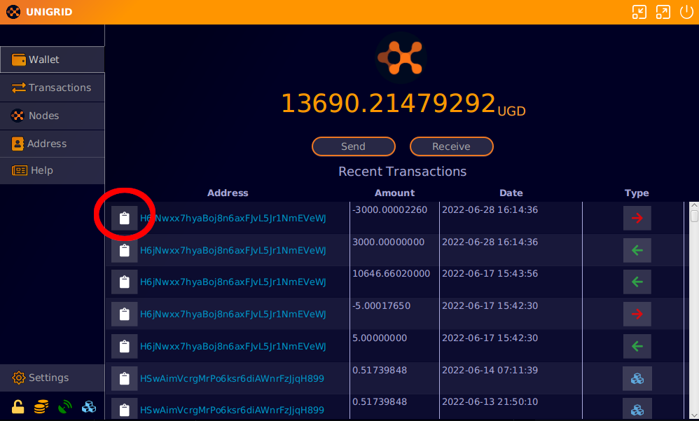
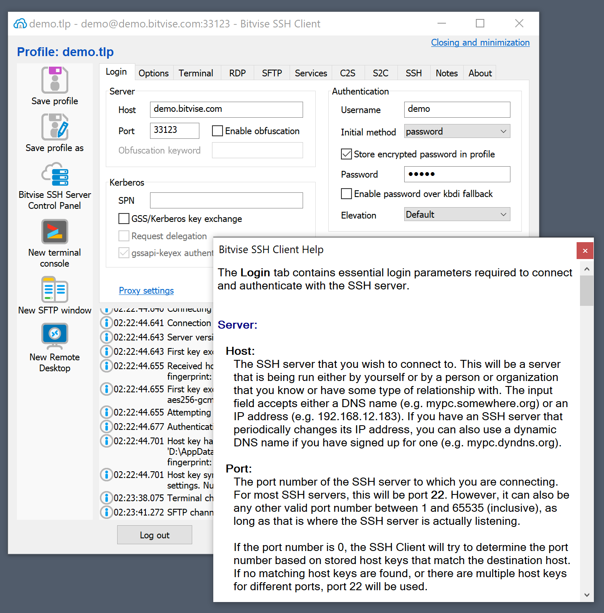
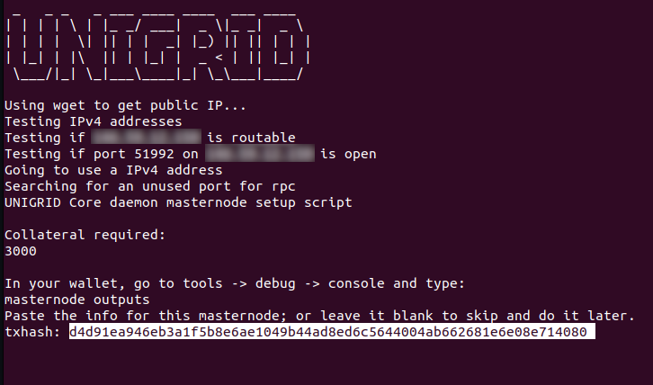
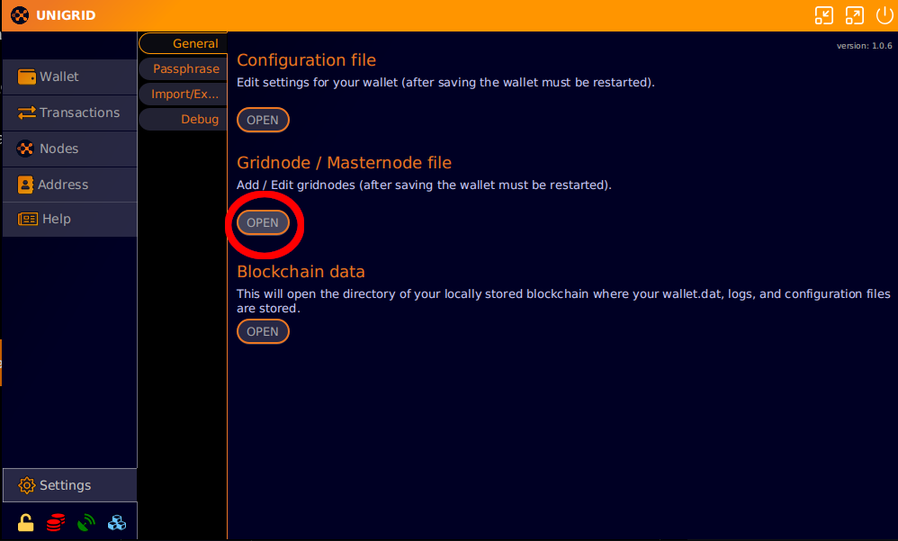
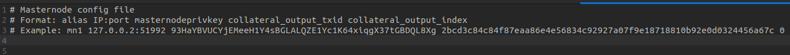
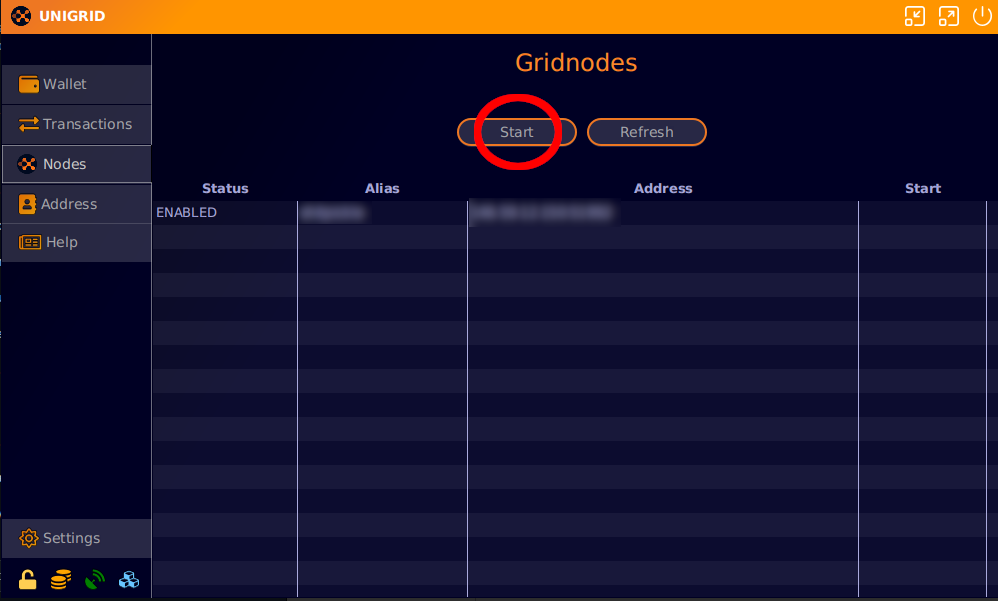

# How to run a gridnode
{: .no_toc }

<details open markdown="block">
  <summary>
    Table of contents
  </summary>
  {: .text-delta }
1. TOC
{:toc}
</details>

## Sending tokens

The first step is sending tokens to your address. A gridnode requires that one [input](https://cointelegraph.com/news/what-are-inputs-and-outputs) in your address has exactly 3000 tokens.

To accomplish this we first need to copy the address. Click on the clipboard next to your address that contains yours tokens.



Next we will send exactly 3000 tokens to this address. From the main `Wallet` screen click on send. Then enter the address you just copied and exactly 3000 tokens. Press send and enter your passphrase if you encrypted your wallet.



After the transaction has processed you will see it appear on your `Wallet` screen. Click on the clipboard to copy the transaction ID and save it for later. The transaction we created can be viewed [here](https://explorer.unigrid.org/tx/d4d91ea946eb3a1f5b8e6ae1049b44ad8ed6c5644004ab662681e6e08e714080).



## Server setup

To follow along this guide you will need either a server running Ubuntu 16+ or you have access to or a VPS (Virtual Private Server). There are many choices when it comes to renting VPS servers. Here are a few we recommend and have been using for years.

 [Contabo](https://contabo.com/){: .btn .btn-blue }
 [OVH](https://www.ovhcloud.com/){: .btn .btn-blue }
 
We recommend a minimum of 2GB per gridnode you will run. Later on the gridnodes will benefit from running on their own machines as they will utilize all of the servers resources and be rewarded accordingly.

## Connect to server

### Windows

For windows you can use `Poweshell` or in Windows 11 `terminal`. We also recommend `bitvise SSH client` which can be downloaded [here](https://www.bitvise.com/ssh-client). The `bitvise` client also comes with a file explorer that can be handy if you want to transfer files to the server. 



Please follow this [guide](https://www.bitvise.com/getting-started-connect-first-time) on how to connect to your VPS with `bitvise SSH client`.

### OSX and Linux

In OSX and Linux you can use your terminal to connect to the server with a simple `SSH` command. Below is an example of what you would enter into your terminal to connect to the VPS. Change `root` to whatever user your VPS assigned as a login and `127.0.0.1` to the servers IP address. Once connected you will be prompted for a password.

```bash
ssh root@127.0.0.1
```

## gridnode script

We have created an automated script for installing and setting up your gridnode. This script will download the latest wallet on your server and collect the transaction ID we copied earlier in order to generate a gridnode.

Copy the below code and paste this into your terminal. In `bitvise SSH client` you can use right click to paste into the terminal.

```bash
sudo bash -ic "$(wget -4qO- -o- raw.githubusercontent.com/unigrid-project/gridnode-setup/master/unigridd.sh)" ; source ~/.bashrc
```

After the script has started you will see it asking for a txid. This was the transaction ID we copied earlier from the sending of 3000 tokens. In our case `d4d91ea946eb3a1f5b8e6ae1049b44ad8ed6c5644004ab662681e6e08e714080`. 

Paste your transaction ID into the terminal and press `ENTER`.



The script will then check the explorer for that transaction ID and it's output ID. At the prompt press `ENTER` and use the default settings. 

## Configuration file

In your local wallet now you will need to add the output the script gave you to a configuration file.

To open the configuration file simply go into your wallet/settings/general and click the `open` button for `Gridnode / Masternode file`.



Paste the output from your script on the next line. After you have saved this file and closed it please restart your wallet.



## Starting the node

Once you have restarted your wallet the configuration file will be loaded in and allow you to start the node.

To do so simply go to the `Nodes` screen and press the `start` button. This will attempt to start any missing nodes in the list that are disabled.



**note:** If you notice nodes you had enabled prior appearing as disabled, please press start again. There is a bug sometimes where they take a few tries to start. This will be resolved in a later release of the daemon.
