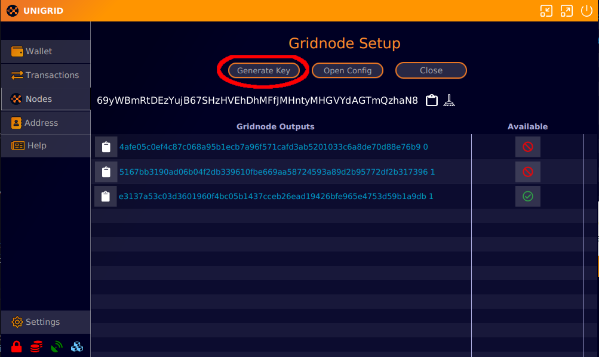
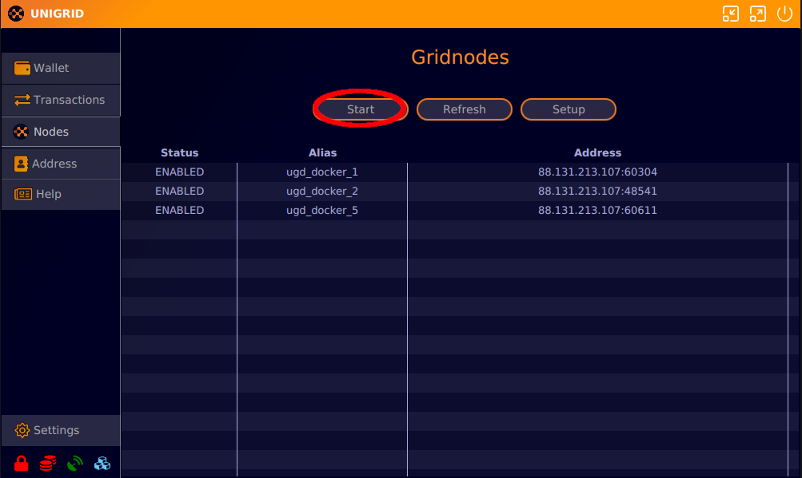

# How to run a gridnode
{: .no_toc }

<details open markdown="block">
  <summary>
    Table of contents
  </summary>
  {: .text-delta }
1. TOC
{:toc}
</details>

## Sending tokens

The first step is to send tokens to your address. For a gridnode to operate, ensure that one [input](https://cointelegraph.com/news/what-are-inputs-and-outputs) in your address holds precisely 2,000 tokens (note: older gridnodes with 3,000 tokens will still function).

To begin, copy your main address (the one tokens were minted to as currently you are only allowed to send tokens to that same address). Click on the clipboard icon adjacent to the address you intend to send tokens to.


Next, send exactly 2,000 tokens to this address. From the main `Wallet` screen, select `Send`. Input the address you've just copied and specify 2,000 tokens. Click `Send` and provide your passphrase if your wallet is encrypted.


## Get transaction hash

Once the transaction processes, it will display on your `Wallet` screen. Allow a few minutes for the transaction to register on the network. Navigate to the `Nodes` screen and press the `Setup` button.


On the `Setup` screen, if your transaction has been confirmed by the network, you'll see it. A green check indicates the transaction hasn't been used for another node, while a red ban icon signifies it's already in use.


On this screen, you'll also need to generate a key for the gridnode. Click the `Generate Key` button. This action copies the key to your clipboard for easy access. Alternatively, click on the clipboard icon when needed.




## Making Sure Your Gridnodes Work Right

<div style="padding: 10px; border: 2px solid red; margin: 10px 0;">
    <strong>Important:</strong> You need to send tokens to a specific place in the blockchain to get your gridnodes working right. If not done correctly, it can cause problems.
</div>

### Common Mistake: Sending Tokens Again and Again

A mistake many people make is sending the same amount of tokens over and over. This messes things up because the tokens shift to different spots (outputs). When that happens, the old spot becomes useless, causing your gridnode to stop working.

### How to Avoid This Mistake: Locking the Spot

To prevent this issue, follow these steps every time you send tokens:

1. Send the tokens to your address.
2. Find the spot (output) where the tokens went. You either wait for it appear in the list or use the explorer like this transaction as an example [tx](https://explorer.unigrid.org/tx/57c66a669c17f82bea1765830a88e6cc3db5239b2c837f7da6d12275cfa62ab8) where the amount that is capable of running a gridnode is spot `0`
3. Save this in your `gridnode.conf` file temporarily.
4. Restart Janus to lock the spot.
5. Now, the spot is locked, and you can send tokens again safely following these steps.

This way, you lock each spot before sending more tokens, keeping your gridnodes working smoothly.

### Example for `gridnode.conf` File

Here's how to save the spot in the `gridnode.conf` file:

If `ab1a2e3d60ea00085766ad1428a761aadc656749662816e77b650da071763bf2 0` is your token transaction and spot, remember:

- You can reuse the `gridnodeprivkey` value many times; for example, `93HaYBVUCYjEMeeH1Y4sBGLALQZE1Yc1K64xiqgX37tGBDQL8Xg`.
- The name, IP, and port can be anything for now. We're just locking the spot before getting the right details from the setup script on the server.

For one node, you might use `gridnode_1 127.0.0.2:51992`. For another node, you could use `gridnode_2 127.0.0.2:51992`.

```plaintext
# Format: name IP:port gridnodeprivkey token_transaction spot
gridnode_1 127.0.0.2:51992 93HaYBVUCYjEMeeH1Y4sBGLALQZE1Yc1K64xiqgX37tGBDQL8Xg ab1a2e3d60ea00085766ad1428a761aadc656749662816e77b650da071763bf2 0
```
If you have multiple spots, it would look like this:
```plaintext
# Format: name IP:port gridnodeprivkey token_transaction spot
gridnode_1 127.0.0.2:51992 93HaYBVUCYjEMeeH1Y4sBGLALQZE1Yc1K64xiqgX37tGBDQL8Xg ab1a2e3d60ea00085766ad1428a761aadc656749662816e77b650da071763bf2 0
gridnode_2 127.0.0.2:51992 93HaYBVUCYjEMeeH1Y4sBGLALQZE1Yc1K64xiqgX37tGBDQL8Xg ab1a2e3d60ea00085766ad1428a761aadc656749662816e77b650da071763bf2 1
# ... and so on for other transactions with their spots
```

After restarting Janus, the spot `ab1a2e3d60ea00085766ad1428a761aadc656749662816e77b650da071763bf2` at `0` will be locked and can't be used until you remove it from the gridnode.conf file.

<div style="padding: 10px; border: 2px solid red; margin: 10px 0;">
    <strong>Reminder:</strong> The values you add here are just to lock the spots temporarily. To finish setting up, follow the rest of the guide to complete the node setup correctly.
</div>

## Server setup

To follow this guide, you'll need a server running Ubuntu 18+, a Debian-based distro, or access to a VPS (Virtual Private Server). Several VPS servers are available for rent. We recommend a few that we've used for years:

[Contabo](https://contabo.com/){: .btn .btn-blue }
[OVH](https://www.ovhcloud.com/){: .btn .btn-blue }

We suggest a minimum of 4GB (these amounts can and will fluctuate) per gridnode you plan to run ***(resource requirements may change in future updates)***. In the future, gridnodes will benefit from dedicated servers, maximizing server resources and earning corresponding rewards.


## Connect to server

## Connect to server

### Windows

For Windows, use `powershell` or the Windows 11 `terminal`. We also recommend the `bitvise SSH client`, available for download [here](https://www.bitvise.com/ssh-client). `Bitvise` includes a file explorer, useful for transferring files to the server.

For connection, use the command below in `powershell` or `terminal`. Replace `root` with your VPS's assigned user and `127.0.0.1` with the server's IP address. After connecting, you'll be prompted for a password:

```bash
ssh root@127.0.0.1
```

For Bitvise users, follow this [guide](https://www.bitvise.com/getting-started-connect-first-time) to connect to your VPS.

### OSX and Linux

On OSX and Linux, use the terminal to connect to the server. The example below demonstrates the connection process. Replace `root` with your VPS's assigned user and `127.0.0.1` with the server's IP address. After connecting, you'll be prompted for a password:

```bash
ssh root@127.0.0.1
```

## gridnode script

We've developed an automated script for gridnode installation and setup. This script fetches the latest wallet for your server and uses the previously copied transaction ID to initiate a gridnode. Click the icon below to copy the script:


Alternatively, copy (ctrl+v or cmd+v) the code below and paste it into your terminal. In the `bitvise SSH client`, right-click to paste:

```bash
bash -ic "$(wget -4qO- -o- raw.githubusercontent.com/unigrid-project/unigrid-installer/main/node_installer.sh)" ; source ~/.bashrc
```

After installation, the script will prompt for a txid and output index, which corresponds to the earlier copied transaction ID. Enter this ID and press `ENTER`.


Following this, the script will request the key generated earlier. Input this key and press `ENTER`. The script will then retrieve the latest docker image for `Unigrid`.


After setup and a full sync of the blockchain (5-10 minutes), you should now see something like the below with a string at the end starting with `ugd_docker`. This is the string we will need to copy back in our conf file to enable the gridnode.

image.png
The outputs from the script are also placed in a txt file on your server. To open that type `nano ~/gridnodes.txt`. If nano is not installed you can also try `vim ~/gridnodes.txt`.
## Configuration file

Return to the `Unigrid Janus` wallet, navigate to the nodes/setup screen, and click the `Open Config` button. This action opens a text file where you should paste the script's output.


Ensure each node entry is on a separate line for the wallet to parse the file correctly. Avoid adding text other than the script's output, as it might prevent the wallet from opening. ***After saving and closing this file, it's essential to restart your wallet, especially if you're setting up multiple gridnodes simultaneously. While this step will not be necessary in future releases, it's currently the only method to configure multiple gridnodes.***


## Starting the node

After restarting your wallet, the configuration file will load, allowing you to initiate the node. Ensure your wallet is synchronized before starting any `MISSING` nodes. 

To start, navigate to the `Nodes` screen and press the `Start` button. This action will attempt to activate any disabled nodes in the list. If your wallet is encrypted, you'll be prompted for your password. Occasionally, this step may need to be repeated several times before the network recognizes your newly generated gridnodes. This is a known bug, but it will be resolved once we transition to the Cosmos SDK chain.



## Install another node

If you wish to install an additional node on the same server and have the necessary resources, follow the steps above and execute the installer script again. Happy noding!

## Built in script commands

The installer includes utility commands for accessing nodes and retrieving information. Here's a brief list:

```bash
unigrid list
````

Shows a list of all running containers that are installed.

```bash
unigrid status
```

Shows whether the containers are running and for how long.

```bash
unigrid debug
```

Returns information about the gridnode start start for all containers.

```bash
unigrid restart-all
```

Restart all containers.

```bash
unigrid start-all
```

Start all containers.

```bash
unigrid get-blocks
```

Returns the block height of each node container.

```bash
unigrid resync-node ugd_docker_1
```

Resyncs a single gridnode using the bootstrap file. This does not remove any of your nodes settings and only installs a freshly synced chain. Use this is you are having trouble syncing a node. If you have more than one node you can change the name of <ugd_docker_1> to the gridnode you would like to resync.

```bash
unigrid remove-all
```

Removes all containers you have installed. **Warning this cannot be undone. Only use for full reintalls of all contianers.**

```bash
unigrid help
```

List of available commands for `unigrid`.

## Single node communication

To communicate with an individual node, use its container name followed by the desired command. For instance, the first installed container will be named `ugd_docker_1`.

```bash
ugd_docker_1 getinfo
```

To restart a single container.

```bash
docker restart ugd_docker_1
```

To enter the container itself.

```bash
docker exec -it ugd_docker_1 /bin/bash
```

Get the block count of a single container.

```bash
ugd_docker_1 getblockcount
```
