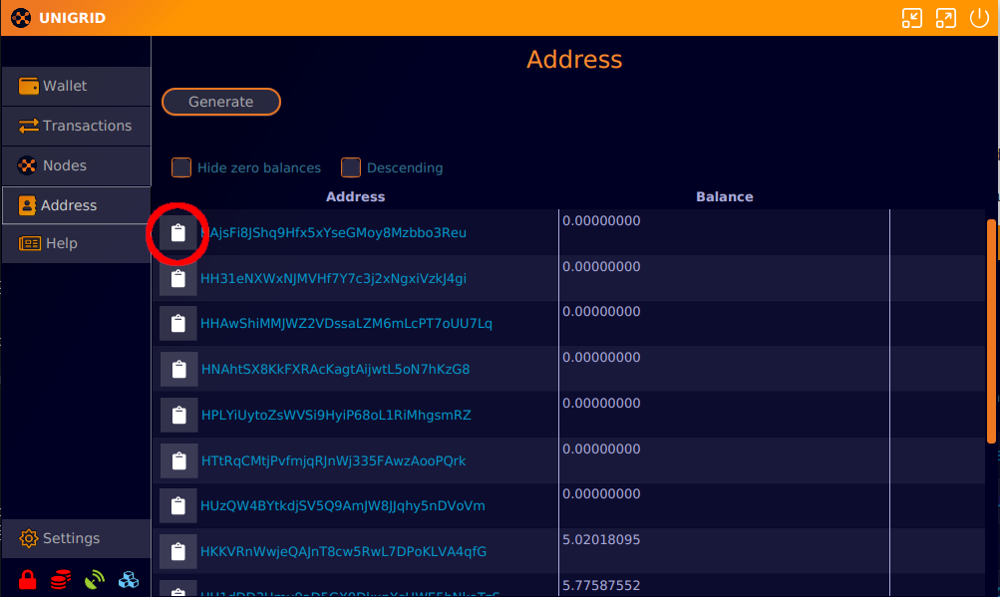

# How to run a gridnode
{: .no_toc }

  

    Table of contents
  

  {: .text-delta }
1. TOC
{:toc}

## Sending tokens

The first step is getting tokens into an exact input amount. A gridnode requires that one input has exactly 3000 tokens. To accomplish this we first need to copy the address. Click on the clipboard next to your address that contains yours tokens.

Next we will send exactly 3000 tokens to this address. From the main `Wallet` screen click on send. Then enter the address you just copied and exactly 3000 tokens. Press send and enter your passphrase if you encrypted your wallet.

After the transaction has processed you will see it appear on your `Wallet` screen. Click on the clipboard to copy the transaction ID and save it for later. The transactrion we created can be viewd here [Explorer](https://explorer.unigrid.org/tx/d4d91ea946eb3a1f5b8e6ae1049b44ad8ed6c5644004ab662681e6e08e714080){: .btn .btn-blue }

## Server setup

To follow along this guide you will need either a server running Ubuntu **tested on Ubuntu 22**, you have access to or a VPS (Virtual Private Server).
