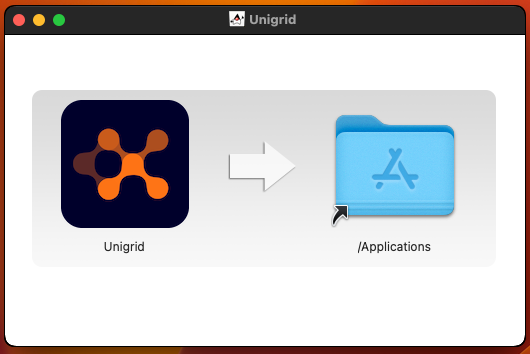
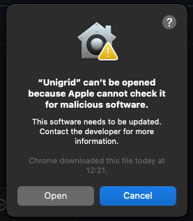
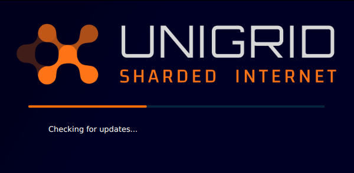
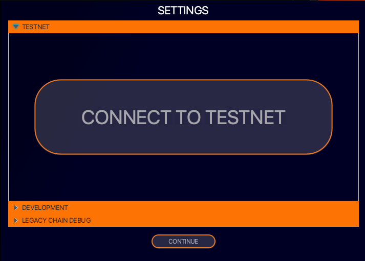
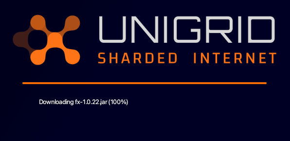
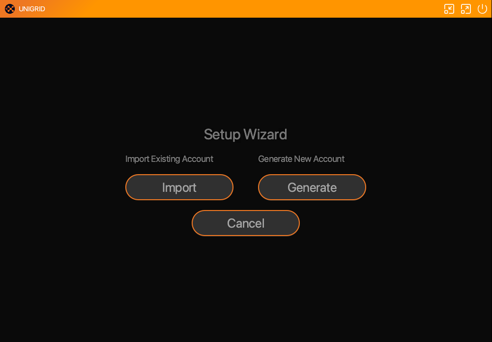
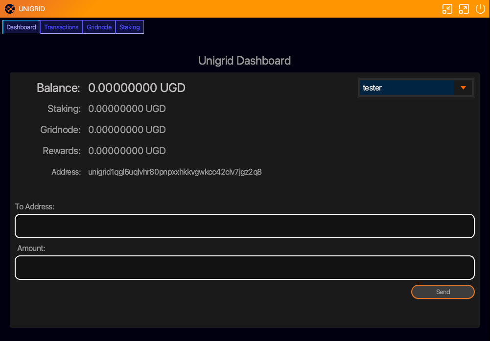
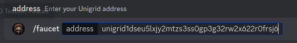

# How to get the desktop app
{: .no_toc }

  

    Table of contents
  

  {: .text-delta }
1. TOC
{:toc}

# Introduction

Welcome to the Unigrid Desktop app. This desktop application connects to our Unigrid testnet network, providing users with staking, sending, creating accounts, and running gridnodes. This guide will assist you in installing and configuring the app effectively.

> **Disclaimer**
> 
> The Unigrid Desktop app is currently in its beta phase and connects to a testnet blockchain. Please note that the testnet is used for testing and development purposes only. Tokens on this network are for testing and hold no real-world value. We are dedicated to improving the functionality and stability of the app; however, you might encounter bugs or issues during this beta phase. We value your patience and feedback, which are crucial for enhancements. For any issues or suggestions, please join our Discord community or reach out to our support team.

## Downloading and Installing the Unigrid App

1. Download the installer for your operating system.

  <a href="https://github.com/unigrid-project/janus-java/releases/download/v1.0.13/Unigrid-1.0.13.dmg" class="btn btn-blue fs-5 mb-4 mb-md-0 mr-2">MAC</a>
  <a href="https://github.com/unigrid-project/janus-java/releases/download/v1.0.13/Unigrid-1.0.13.msi" class="btn btn-green fs-5 mb-4 mb-md-0 mr-2">WINDOWS</a>
  <a href="https://github.com/unigrid-project/janus-java/releases/download/v1.0.13/unigrid_1.0.13_amd64.deb" class="btn btn-purple fs-5 mb-4 mb-md-0 mr-2">LINUX</a>

2. Find the downloaded file and double-click to initiate installation.

***Mac users will need to drag the Unigrid app into their Applications folder. After this step in order to start the app you will need to give gatekeeper permissions to run it.***

  

***Mac users***

***Please follow these steps from this [Apple Guide](https://support.apple.com/en-gb/guide/mac-help/mh40616/14.0/mac/14.0) on how to give permissions to the App (a later release we will notarize the app). In most cases all you need to do is go to the Applications directory and control click the app and select open.***

  

## Connecting to Testnet

When you first start the desktop app you will see this screen appear. Immediately press the F5 key (Mac latop users may need to press fn + F5). If you miss this step the app will attempt to load the legacy chain that requires a 2GB file download. If you missed the `testnet` view just force close the app and restart it.

  

After pressing F5 you will see this menu appear. Simply click on testnet then the `CONNECT TO TESTNET` button.

  

The app will download the neccessary files in order to enable conenction with our testnet. 

  

On first load you will get a view of the wizard to help you import or generate a new account. If you already generated an account in keplr this can be imported. If not just click on generate and follow the instructions on how to create the new account.

 

Once you have generated an account you should now see the main view like below. To copy your address simply click on it.

 

 To get yourself some testnet tokens join our discord and join the `#testnet-faucet` channel.

 [UNIGRID DISCORD](https://discord.gg/p5Tm4rX6EH){: .btn .btn-secondary .fs-5 .mb-4 .mb-md-0 .mr-2 }

To use the bot start by typing `/faucet` then paste your address.

 

A testnet explorer is running here [TESTNET EXPLORER](https://explorer-devnet.unigrid.org/unigrid-testnet-5){: .btn .btn-blue .fs-5 .mb-4 .mb-md-0 .mr-2 }

***Coming Soon!! (Guide to running gridnodes.)***