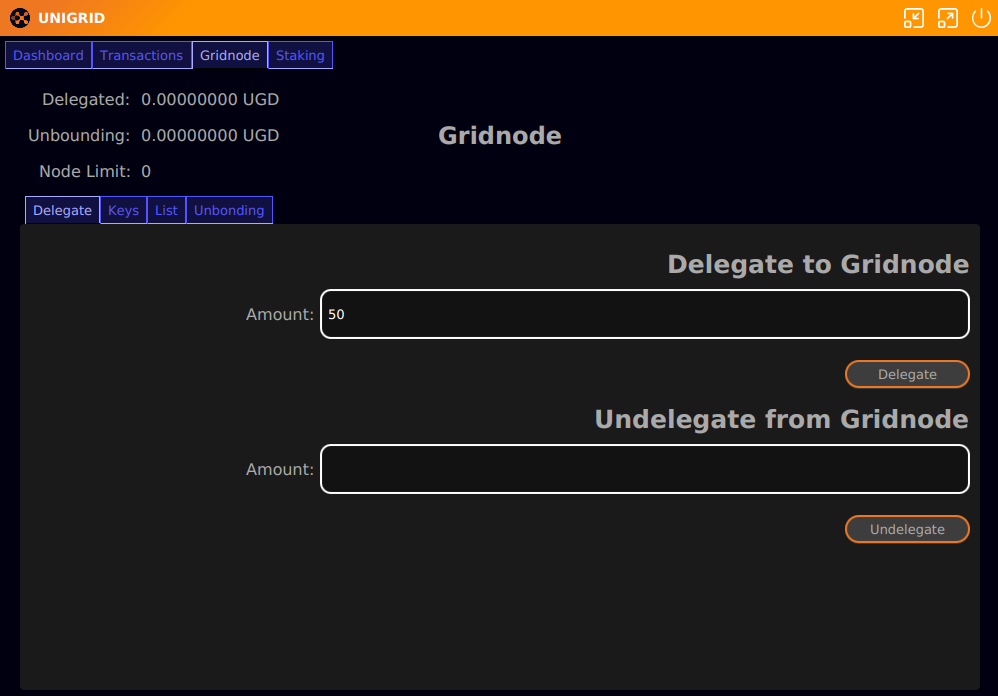
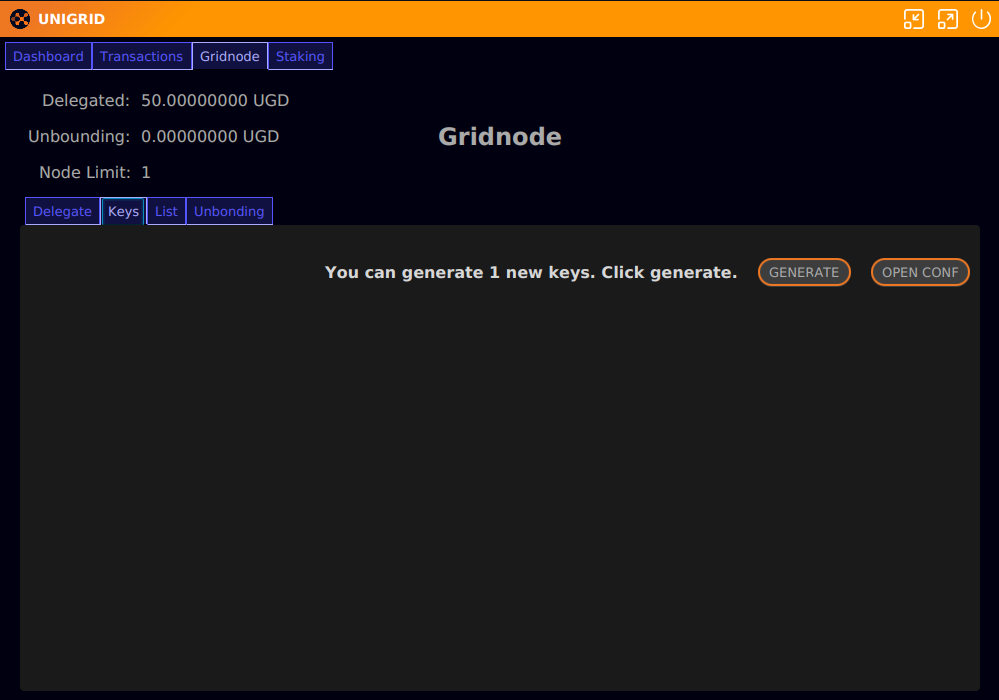
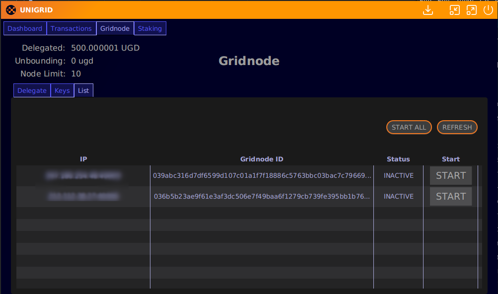

# How to Run a Testnet Gridnode
{: .no_toc }

<details open markdown="block">
  <summary>
    Table of contents
  </summary>
  {: .text-delta }
1. TOC
{:toc}
</details>

# Introduction

Running a Gridnode on the new network is a streamlined process compared to the legacy chain. Rather than creating a transaction for each Gridnode, users can now delegate tokens to the Gridnode module corresponding to the number of nodes they wish to run. This guide will walk you through setting up one Gridnode on the testnet.

## Delegating Tokens to the Gridnode Module

1. Navigate to the `Gridnode/Delegate` tab in your wallet.
2. Enter the number of tokens you wish to delegate. On the testnet, it requires only 50 tokens per Gridnode.
3. Confirm the delegation. Once successful, you should see "Node Limit: 1" indicating your capacity to run one Gridnode.

  
  

## Generating a Gridnode Key

1. Proceed to the `Gridnode/Keys` tab. 
2. You should see a notification indicating that you can generate a new key. Click on the `Generate` button.
3. After entering your password, your Gridnode key will be displayed. Keep this key safe, as it will be needed later.

  
  
## Setting Up a Docker Container

1. Ensure you have Python installed on your system. This script is designed for Debian-based Linux distributions.
2. Run the following commands in your server/VPS terminal:

```bash
curl -sSL -o install.py https://raw.githubusercontent.com/unigrid-project/hedgehog-docker/master/install.py
python3 install.py
```


3. During the setup, choose option `1` for testnet.
4. When prompted for your Gridnode key, return to the desktop app, copy your key, and paste it into the setup script prompt.

## Starting Your Gridnode

1. After the installation, it may take 5-10 minutes for your Gridnode to appear in the `Gridnode/List` tab. Note: We're working on an update to populate this list faster.
2. Once your Gridnode appears, click `START` and enter your passphrase to activate the Gridnode.

  


## Notes on Undelegating Tokens

- The undelagating period on the testnet is set to 2 minutes for expedited testing (it will be 21 days on the mainnet).
- You're encouraged to experiment with the Delegate/Undelegate process and setting up new keys for a comprehensive understanding.


## Removing the docker container

To remove the docker containers you can use the below commands.

```bash
docker stop watchtower hedgehog
docker rm watchtower hedgehog
```

Congratulations! Your Gridnode should now be up and running on the testnet. Feel free to reach out on our [Discord community](https://discord.gg/p5Tm4rX6EH) for support or to share your experience.
