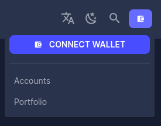
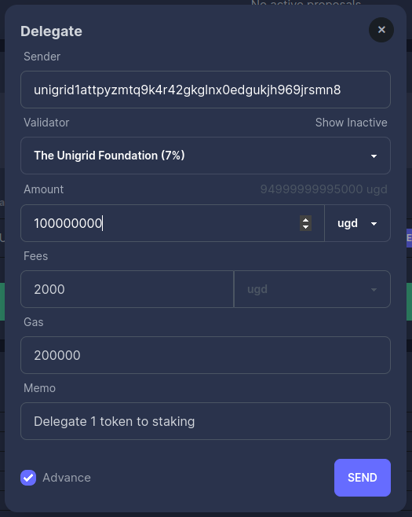
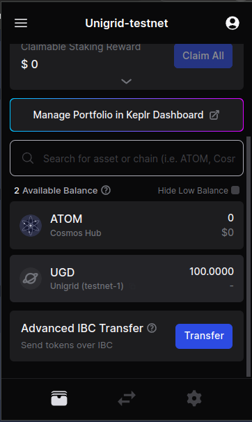

# How to get testnet tokens
{: .no_toc }

  

    Table of contents
  

  {: .text-delta }
1. TOC
{:toc}

## Connecting to the Unigrid Testnet and Generating an Address

> 🚨 **Important Note:** 
> - Our testnet currently supports **desktop users only**. Mobile users cannot add a custom chain to the Keplr wallets at this time.
> - The Unigrid testnet is under active development. We may periodically reset the chain to implement new features or address bugs.
> - Tokens on this testnet are for **testing purposes only** and hold no real-world value.
> - Sending tokens being disabled is a feature not a bug as we test the vesting module.

### 1. Install the Keplr Browser Extension

- Visit [Keplr's official website](https://www.keplr.app/).
- Install the Keplr extension for your browser. If you're familiar with Metamask, the Keplr setup process will be similar.
- Ensure you create an account and securely back up your credentials.

### 2. Add the Unigrid Chain to Keplr

> Add `unigrid-testnet-4` to keplr: <https://docs.unigrid.org/unigrid-cosmos-networks/>
- The connection interface should resemble:

### 3. Obtain Your Unigrid Testnet Address

- After connecting, access the dashboard to view your Unigrid testnet address.

### 4. Acquire Testnet Tokens 🚰

- Join the Unigrid [Discord channel](https://discord.gg/JDAYCJ9tEb).
- Request access to the #testnet-faucet channel.
- Use the bot in this channel to mint testnet tokens by typing: `/faucet <your-address>`

> If you are a validator and in need of more funds, you can request them via this [form](https://forms.gle/Ubv2u6T1AWgWkTRS9).

### 5. Delegate Tokens for Staking

- With your testnet tokens, go to the [Unigrid Testnet Explorer](https://explorer-testnet.unigrid.org/).
- Connect the explorer to your Keplr wallet.
  
- Delegate tokens to one of the available validators for staking.

***When using this explorer and delegating tokens there are 8 decimals you need to add. For example if we want to delegate 1 token, the amount to enter would be 100000000.***

### 6. Sending tokens
In keplr you can add or create multiple wallets. If you would like to test sending tokens this is a good way to do so. With an address selected that contains UGD tokens you can clik on it which will bring you to a send window.
  

---

Remember to periodically check for updates and announcements regarding the testnet's status and developments.
