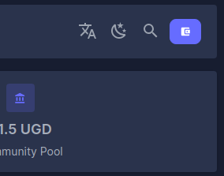
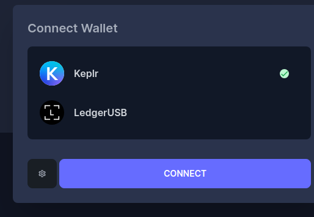
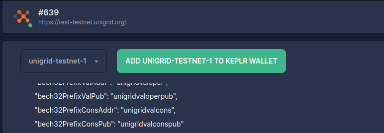
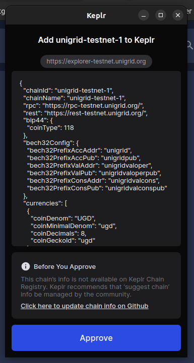
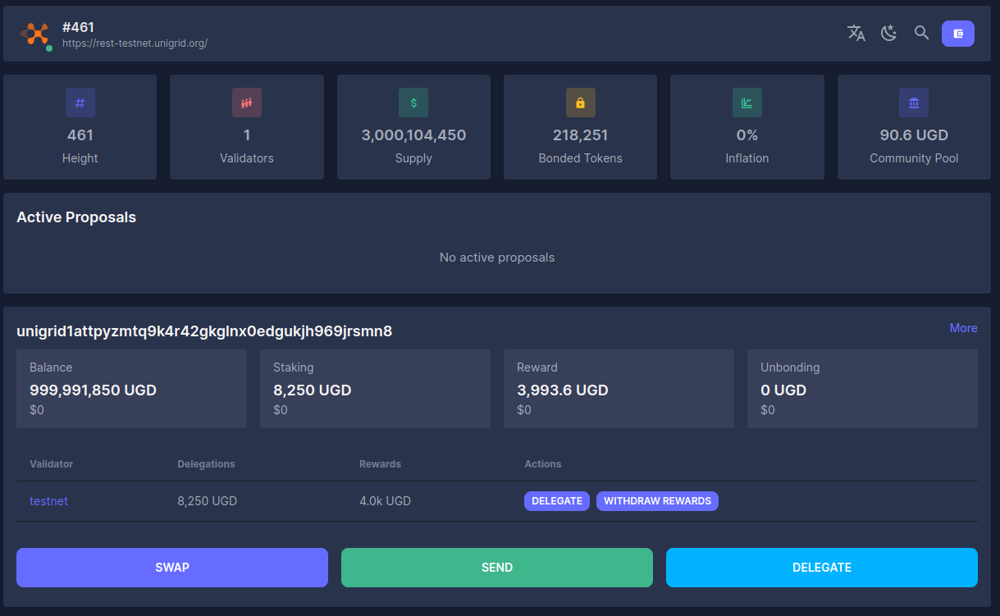

# How to get testnet tokens
{: .no_toc }

  

    Table of contents
  

  {: .text-delta }
1. TOC
{:toc}

## Connecting to the Unigrid Testnet and Generating an Address

> 🚨 **Important Note:** 
> - Our testnet currently supports **desktop users only**. Mobile users cannot add a custom chain to the Keplr wallets at this time.
> - The Unigrid testnet is under active development. We may periodically reset the chain to implement new features or address bugs.
> - Tokens on this testnet are for **testing purposes only** and hold no real-world value.
> - Sending tokens being disabled is a feature not a bug as we test the vesting module.

### 1. Install the Keplr Browser Extension

- Visit [Keplr's official website](https://www.keplr.app/).
- Install the Keplr extension for your browser. If you're familiar with Metamask, the Keplr setup process will be similar.
- Ensure you create an account and securely back up your credentials.

### 2. Add the Unigrid Chain to Keplr

- Go to the [Unigrid Testnet Explorer](https://explorer-testnet.unigrid.org/).
- Click "Connect Wallet" in the top right corner.
  
- Select the gear icon on the left.
 
- Click "Add UNIGRID-TESTNET". 
  - *Note: This step is temporary for the testnet phase. The Unigrid chain will be integrated into Keplr upon official release.*

- The connection interface should resemble:

### 3. Obtain Your Unigrid Testnet Address

- After connecting, access the dashboard to view your Unigrid testnet address.

### 4. Acquire Testnet Tokens

- Join the Unigrid [Discord channel](https://discord.gg/JDAYCJ9tEb).
- Request access to the #testnet-faucet channel.
- Use the bot in this channel to mint testnet tokens by typing: `/faucet <your-address>`

### 5. Delegate Tokens for Staking

- With your testnet tokens, return to the [Unigrid Testnet Explorer](https://explorer-testnet.unigrid.org/).
- Delegate tokens to one of the available validators for staking.

---

Remember to periodically check for updates and announcements regarding the testnet's status and developments.
