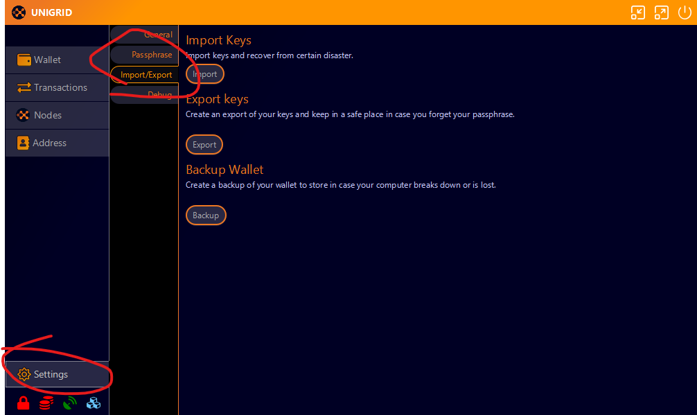
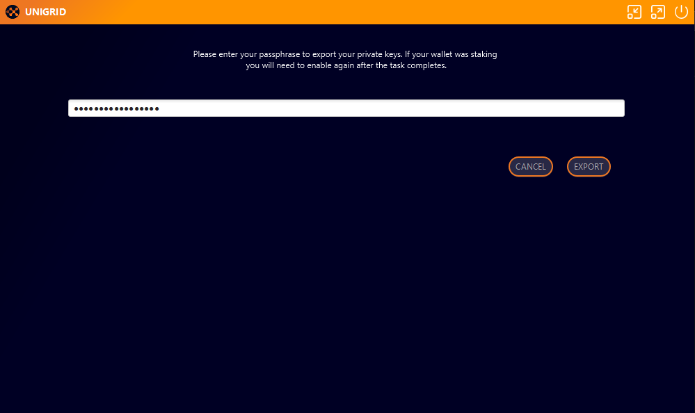

## How to backup your wallet

With your wallet open you can easily backup keys and the wallet itself. The first step is to go into settings then import/export tab.

From here you can either export your keys, backup you wallet, or both. 
_Keep in mind when exporting your keys that these are your private keys you should never share with anyone else and store in a safe location._

If your wallet is encrypted you will be prompted to provide the passphrase you encrypted the wallet with.

**After entering your passphrase the wallet will only remain unlocked for a short amount of time. If it takes to long to select a name location for your files you will need to repeat the process.**

