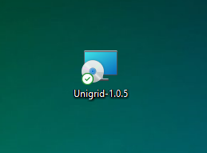
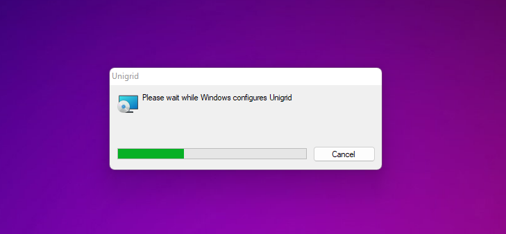
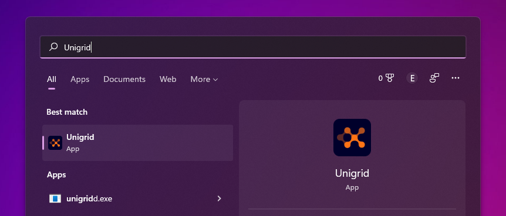
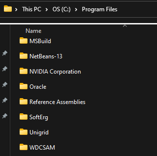
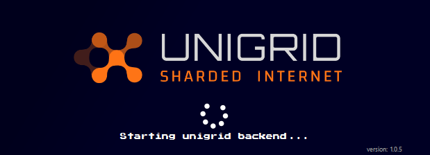
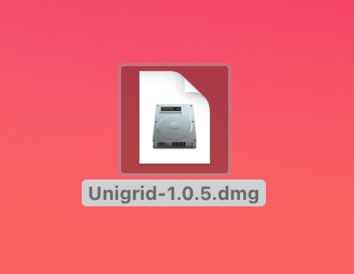
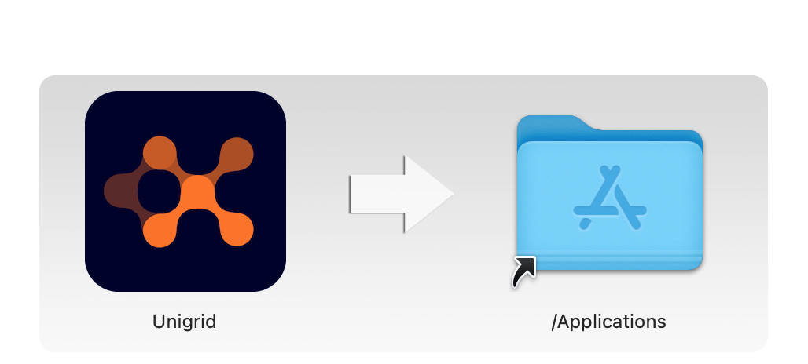

## How to upgrade your wallet
{: .no_toc }

  

    Table of contents
  

  {: .text-delta }
1. TOC
{:toc}

If you are coming from version 2.0.0 or 2.0.1 and need to upgrade to version 2.0.2 please follow along.

For the most part the installation and setup will be automated and not require any extra steps from you. The new wallet uses the same blockchain data folder as v2.0.0 and 2.0.1.

## Widows

Windows specific instructions. 

The first step is to make sure you have closed the old version of the Qt wallet. After this you can run the MSI installer package. Simply double click on the installer and approve the install. 

This will install the new wallet in your Programs folder on your main hard drive.

You can now open the Unigrid wallet and let the wallet start its initialization phase. 

### Troubleshooting

- [If you run into an error please see the troubleshooting doc]({{ site.baseurl }})

## OSX

OSX specific instructions.

The first step is to make sure you have closed the old version of the Qt wallet. After this you can run the DMG package. Simply double click on the DMG file and drag Unigrid into your Applications.

