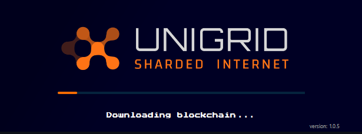

## Troubleshooting Common Problems
{: .no_toc }

  

    Table of contents
  

  {: .text-delta }
1. TOC
{:toc}

## Wallet stuck on startup screen

If your wallet has been stuck on the startup screen for a long period and does not appear to start. This can happen for a few different reasons.

1.  Your old wallet is still running not allowing the new wallet to start.
2.  Corrupted blockchain data.
3.  Backend not starting properly.

If your old wallet was still running you will need to close that before starting the new Unigrid Janus wallet. If you have the Unigrid Janus wallet running you need to make sure all processes are stopped first.

#### Windows

{: .no_toc }

On Windows press `CTRL + ALT + DEL` and select task manager. In most cases Unigrid will appear at the top of the list there.

If you had closed the wallet using a right click you may only see the unigridd.

Stopping these services can be performed by right clicking them then selecting `End task`.

##### Restart wallet

You can now try to restart the Unigrid wallet to check if this has resolved your issues.

##### Force download blockchain

If restarting the wallet did not resolve your issues you can force the wallet to re-download the blockchain data. This will take roughly 7-10 minutes depending on network speed to complete.

In Windows you can click on the magnifier tool and use the search tool to open the AppData folder. Once clicked enter `%appdata%` and press `ENTER`

In some cases you may need to use the `run` tool on Windows. Instead of searching for `%appdata%` search for `run` then press `ENTER`. This will open the run App where you can then enter `%appdata%` and click `OK`.

From here you can open the `UNIGRID` folder to access the blockchain data folder. **Note this is also where your wallet.dat is stored.**

**Before removing anything in this folder be sure to have stopped your wallet.**

_You should also backup your wallet.dat into another location at this time. This is where all of your addresses and tokens are stored._

Next select all of these folders and delete them. 

blocks, chainstate, zerocoin, database, and sporks

After removing these folders and restarting your wallet it will attempt a clean download of the blockchain data.

_If after fully starting you do not see the correct addresses or balance if you have one. It's possible when the wallet restarts it will create a new wallet.dat and backup the old one. If this does happen, just close the wallet after a successful start and replace the wallet.dat in the UNIGRID folder with the correct one and restart._

#### OSX

{: .no_toc }

On OSX...

##### Restart wallet

You can now try to restart the Unigrid wallet to check if this has resolved your issues.

##### Force download blockchain

If restarting the wallet did not resolve your issues you can force the wallet to re-download the blockchain data. This will take roughly 7-10 minutes depending on network speed to complete.

In OSX the blockchain data folder is stored in your computers `Application Support` directory. This can be found in this location `<mac HD>/Users/<username>/Library/Application Support/UNIGRID` replacing `<mac HD>` with the name of your hard drive and `<username>` with your username.

Next select all of these folders and delete them inside `UNIGRID`. 

blocks, chainstate, zerocoin, database, and sporks

After removing these folders and restarting your wallet it will attempt a clean download of the blockchain data.

_If after fully starting you do not see the correct addresses or balance if you have one. It's possible when the wallet restarts it will create a new wallet.dat and backup the old one. If this does happen, just close the wallet after a successful start and replace the wallet.dat in the UNIGRID folder with the correct one and restart._

## Wallet started but blocks are stuck

In the new Unigrid Janus wallet you can check what block your wallet is on by mousing over the blocks icon in the lower left.

Next you can compare this block height with what the current block on the explorer.  

[Explorer](https://explorer.unigrid.org/){: .btn .btn-blue }

If you find that your block count is lower and your wallet is **NOT** progressing please follow these steps.

[Windows](#force-download-blockchain){: .btn .btn-blue } [OSX](#force-download-blockchain-1){: .btn .btn-blue }

